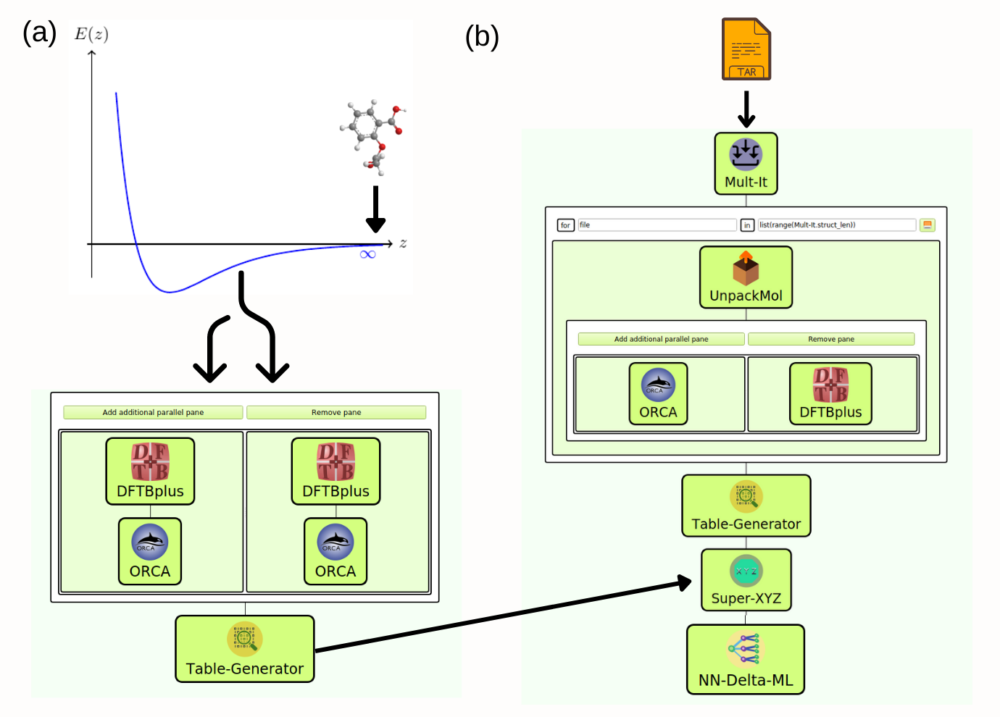

# DFTB-Neural-Net

## Description
This workflow developed in the SimStack framework enables the correction of DFTB potential energy surfaces into ab-initio methods using the $\Delta$-learning neural network. This correction is implemented into the **DFTB+** code for further use on QM/MM simulations. The workflow enables users with no programming or machine learning background to take advantage of this correction and expand it into new systems.

In the folder WaNos there are several different WaNos: **DFT-Turbomole**, **DFTBplus**, **Mult-It**, **NN-Delta-ML**, **ORCA**, **Super-XYZ**, **Table-Generator** and **UnpackMol**, used to build the workflow. Below we describe each one and the main parameter exposed.

## In this workflow, we will be able to:

1. Load a set of molecular trial structures in a `.tar` file.
2. Defining the surface type and setting a molecule's position above the surface (Surface).
3. Run the DFT calculations using VASP code, accounting for the proper corrections (DFT-VASP).
4. Arrange all the total energy values of the system in a table format (Table-Generator). 



**Fig 1** _This workflow aims to perform several DFT calculations of molecules absorbing on a given surface. It is composed of Mult-Mol, Surface, DFT-VASP, and Table-Generator **WaNos** connected by the ForEach loop control. In step 1, we generate the number of points over the surface, where the molecule will be added. Steps 2 and 3 define the surface type and the DFT calculation methods employed in the simulation. The **WaNo** in the last step extracts the inquired variables of the output file from the previous steps._


## 1. Installation and dependencies
Here you will find the steps to install **DFTB+** code and python dependencies necessary to run the workflow. Of course, we assume that you already installed the **DFT** code. You can choose any option available in the [list of quantum chemistry codes.](https://en.wikipedia.org/wiki/List_of_quantum_chemistry_and_solid-state_physics_software.) In this case, we use **ORCA** or **Turbomole**.  

### 1.1 Conda Environment and Python dependencies
Install conda environment, the following packages would be needed:

```
conda create --name environment_name python=3.6 --file environment.yml
```
Install via pip ordered-enum

```
pip3 install ordered_enum
```
## Installing DFTB+ in int-nano machine
> :warning: **If you are installing DFTB+ on a different machine**: Be very careful and make the necessary adjustments.

1. git clone -b machine-learning https://github.com/tomaskubar/dftbplus.git 
2. cd dftbplus
3. module load gnu8/8.3.0
4. module load openblas/0.3.7
5. module load cmake
6. mkdir _build 
7. FC=gfortran CC=gcc cmake -DCMAKE_INSTALL_PREFIX=$HOME/opt/dftb+ -B _build .
8. cmake --build _build -- -j 
9. cmake --install _build

```diff 
+ Check if the `dftb+` executable exist in the dftbplus/_build/prog/dftb+/ folder. If so, then everything is okay. 
```

```diff 
+ be cautious with conda env., it must have libgfortran5 if the installation wants to be done inside the conda environment
```
